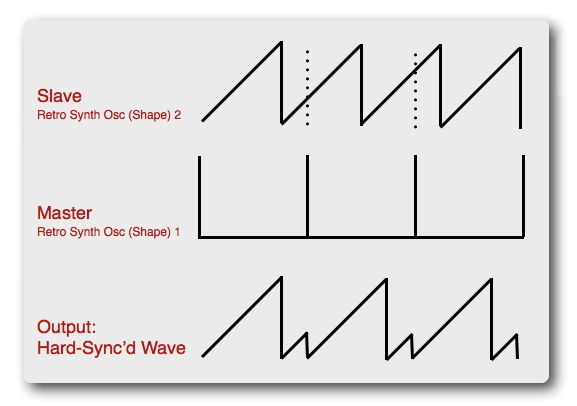
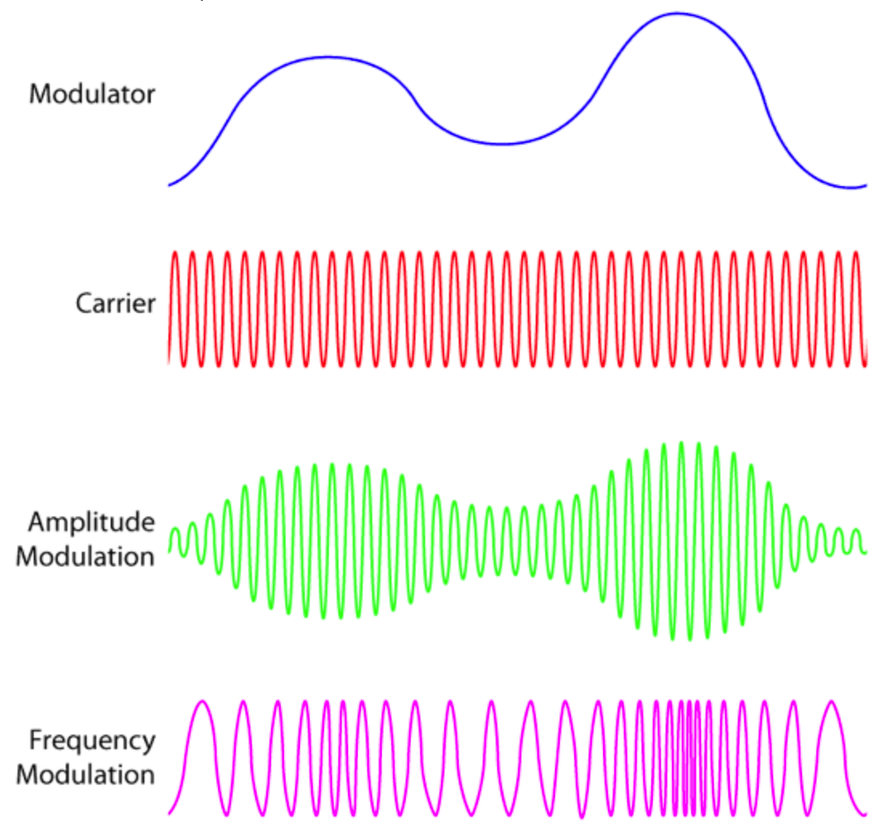

<!-- ---  
title: openFrameworks Advanced
author: Angela Brennecke
affiliation: Film University Babelsberg KONRAD WOLF
date: Winter term 2019/20
---   -->
**openFrameworks Advanced | CTech II**

Prof. Dr. Angela Brennecke | a.brennecke@filmuniversitaet.de | Film University Babelsberg *KONRAD WOLF*

---

**Table of Contents**
- [Day 2: Interaction and Control](#day-2-interaction-and-control)
  - [Practice: Code Review](#practice-code-review)
  - [Sound Interaction - Controlling One Oscillator with Another](#sound-interaction---controlling-one-oscillator-with-another)
    - [Sound Synthesis Sync](#sound-synthesis-sync)
    - [Amplitude Modulation (AM)](#amplitude-modulation-am)
    - [Frequency Modulation (FM)](#frequency-modulation-fm)
  - [Practice](#practice)
    - [Extend the Software Synthesizer Prototype (A1)](#extend-the-software-synthesizer-prototype-a1)
  - [Keyboard Control](#keyboard-control)
  - [MIDI Protocol](#midi-protocol)
    - [Hardware Interface](#hardware-interface)
    - [Communications Protocol](#communications-protocol)
  - [Practice](#practice-1)
    - [Check out ofxMidi (A2)](#check-out-ofxmidi-a2)
    - [MIDI Notes (A3)](#midi-notes-a3)
  - [Further Thoughts on Expanding the ofApp](#further-thoughts-on-expanding-the-ofapp)

# Day 2: Interaction and Control

The second day of the workshop will be dedicated to interaction and control. We will have the oscillators interact with each other and connect the previously developed synthesizer to a MIDI controller. Moreover, we will explore performance aspects and and check out further generic STL containers to support the object management.

## Practice: Code Review

Before we start working on further features of the synthesizer, we will start with a code review session. Review the previously developed prototype and identify one or two aspects of your implementation that you would like to show and review with the group. Consider aspects where you felt stuck as well as aspects where you found a good solution. 

## Sound Interaction - Controlling One Oscillator with Another

One aspect of sound synthesis is the generation of complex sounds by combining different waves with each other as we have seen above. Another interesting aspect of sound synthesis is the generation of complex sounds by emplyoing one oscillator as control element. That is, one oscillator is used such that it controls certain parameters of another oscillator. For example, the LFO is often used to control another sound wave as we have already seen in the initial ofApp example. Here, we will explore three techniques illustrated in the following Image:

(Image)[images/AMFM.png]

### Sound Synthesis Sync

With sound synthesis sync a **master oscillator** controls another **slave oscillator** as illustrated in the following Image. Whenever the Master oscillator has executed one cycle of its loop, it forces the Slave to restart:

[Image Source, last access 19/11/08](https://macprovid.vo.llnwd.net/o43/hub/media/1130/10852/Fig_3.jpg)

### Amplitude Modulation (AM)

Amplitude modulation is a central and classical technique of sound synthesis. Here, a **modulator wave** is used to change the amplitude value of another **carrier wave** as illustrated in the following Image:

The oscillator employed to create the carrier wave usually creates sound at a fixed frequency rate that is much higher than the frequency of the modulator wave. Musically, AM synthesis simulates the **tremolo** effect, i.e., the emulation of a vibration by quickly changing the loudness of a sound.

To control the amplitude A1 of the carrier with the modulator's wave, the following modulation is applied to the wave forms:

- A1 = a1 * sin (2 π f1 t)
- A2 = a2 * sin (2 π f2 t)
- A1 = ( a1 + (A2) ) * sin (2 π f t)

### Frequency Modulation (FM)

Frequency modulation is another classical technique of sound synthesis. Here, instead of modulating or changing the amplitude of the carrier wave, the **modulator wave** is used to change the frequency of the **carrier wave**, as illustrated in the following Image:

As with Amplitude Modulation, the carrier wave is usually defined at a fixed frequency. Musically, FM synthesis simulates the **vibrato** effect, i.e., the emulation of a vibration by quickly changing the pitch of a sound.

To control the amplitude A1 of the carrier with the modulator's wave, the following modulation is applied to the wave forms:

- A1 = a1 * sin (2 π f1 t)
- A2 = a2 * sin (2 π f2 t)
- A1 = a1 * sin ((2 π f + A2) t)

AM and FM modulation are depicted in the following image:

[Image Source, last access 19/11/08](...)

## Practice 

### Extend the Software Synthesizer Prototype (A1) 

Extend the software synthesizer by one (or more) of the above techniques. 

- Check out the fifth assignment sheet in the assignments folder for further instructions.
- You are encouraged to discuss the questions and answers in the group.

## Keyboard Control 

With a first software synthesizer application at hand, we will need to find a convenient way to actually trigger the generation of sounds and melodies. Classically, this is achieved by connecting a keyboard controller to the computer that holds the synthesizer software. The keyboard controller themselves do not play or generate any kind of sound. Rather, they serve as host for specific controller knobs and send certain control parameters to the synthesizer. The receiving synthesizer evaluates the sent messages and triggers certain actions, i.e., generates and plays back a sound, switches between sounds, changes certain modulation parameters, etc. The communications protocol that is used for sending and receiving musical information was developed in the early 1980s. It combines both a hardware interface with a software data exchange protocol and is called MIDI - Musical Instrument Digital Interface.

## MIDI Protocol 

The MIDI standard was introduced in the 1980's as a one-way communications protocol and digital interface description. MIDI allows for connecting software and hardware synthesizers as well as for controlling more than one synthesizer with only one keyboard controller. This is achieved by a dedicated **MIDI hardware interface** and data communications protocol. The latter defines how **MIDI messages** package and exchange musical data between the connected instruments and is defined by the MIDI standard. 

### Hardware Interface

The MIDI hardware interface consist of three different **MIDI ports** that are connected via specific **MIDI cables**

- MIDI IN - for receiving MIDI messages (and subsequently processing them)
- MIDI THRU - for passing on MIDI messages (to another instruments)
- MIDI OUT - for sending MIDI message out (to other instruments)

The introduction of these three ports allowed to easily connect several different MIDI instruments with each other resulting in new ways of layering sounds and playing back polyphonic notes. The following image illustrates the typical MIDI interface ports.

Image

With the increase of software synthesizers and computer generated music, MIDI-to-USB ports have been introduced simplifying the connection of MIDI controllers to computers further. Prior to that, MIDI ports often times were only directly connected to computers with the help of sound cards and audio interfaces.

### Communications Protocol

Central to the communications protocol is the **MIDI message** which carries the musical information encoded in the form of bytes. The byte information a MIDI message contains is composed of two different types of bytes:

- 1 **status byte** which is divdided into 2 Nybbles (2*4 bits) to define
  - MIDI events (bits 5 to 8, stores up to 8 different values)
  - MIDI channels (bits 1 to 4, stores up to 16 different values)
- 1 or more **data bytes** which provide more information on the specific event being sent.

The status byte is defined by the fact that its most significant bit (msb) is always set to 1 whereas the data bytes are defined such that their most significant bit (msb) is always set to 0. This way, you can clearly differentiate the two byte types. Status byte values range from 128 (1000 0000) to 255 (1111 1111) whereas data byte values range from 0 (0000 0000) to 127 (0111 1111).

The following Image illustrates the 8 different **MIDI event types** and the information encoded in the corresponding data bytes:

Image

Midi was primarily introduced to connect and control multiple instruments. One central element of the midi protocol therefore is the **MIDI Channel**. MIDI protocol supports 16 MIDI channels which means, a MIDI controller can send data to 16 different instruments. The sending and receiving MIDI control and/or instrument must specify the channel it is sending and receiving on. Only then a receiving instrument will be able to further process the sent MIDI message.

## Practice

### Check out ofxMidi (A2)

openFrameworks also supports the MIDI communications protocol with the help of a dedicated ofxMidi addon. 

- Check out the first assignment sheet in the assignments folder for further instructions.
- You are encouraged to discuss the questions and answers in the group.

### MIDI Notes (A3)

A MIDI message usually contains all the information necessary to describe (and thus trigger) a musical event, for example. One part of a MIDI message is the **note number** which refers to the actual pitch. MIDI supports 128 different note numbers aka pitches and thus up to 10 different octaves. One octave is comprised of 12 individual pitches, for example: 

- C, C#, D, D#, E, F, F#, G, G#, A, A#, B (chromatic scale with sharps "#")
- C, Db, D, Eb, E, F, Gb, G, Ab, A, Bb, B (equivalent scale with flats "b")

The general formula to calculate any frequency given a certain reference frequency is as follows:

- af = rf * 2 ^ ((cn - rn) / 12.0) 

.. with these components:

- "^" meaning "to the power of"
- af referring to the frequency to be calculate, i.e., any frequency
- rf referring to the reference frequency
- cn referring to the current MIDI note number
- rn referring to the reference MIDI note number

For example, given 440 Hz (pitch A4, MIDI note number 69) as a reference frequency, the formula would look like this:

- af = 440.0 * 2 ^ (midiVal-69)/12.0))

Reconsider your software synthesizer prototype. Connect the MIDI controller with your synthesizer in such a way that it allows you to play back melodies. Check out the second assignment sheet for further instructions. 

## Further Thoughts on Expanding the ofApp 

To deepen your understanding of audio programming either in regards to software design or in regards to the implementation of MIDI communication protocol, take a closer look at the implementations in the following ofxAddon:

- ofxMidi

Interestingly, ofxMidi has been build on top of RtMidi (Midi counterpart to RtAudio). More information can be found at the github repository https://github.com/danomatika/ofxMidi.

For further information on MIDI refer to

- Refining Sound, Chapter 7 - External Control Sources
- https://www.midi.org
- https://www.delamar.de/beats/selber-machen/sequenzer-midi/ 